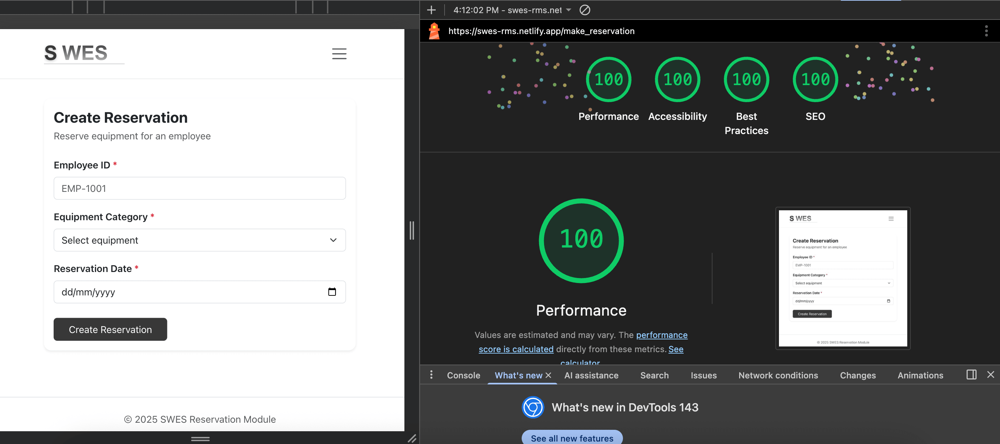
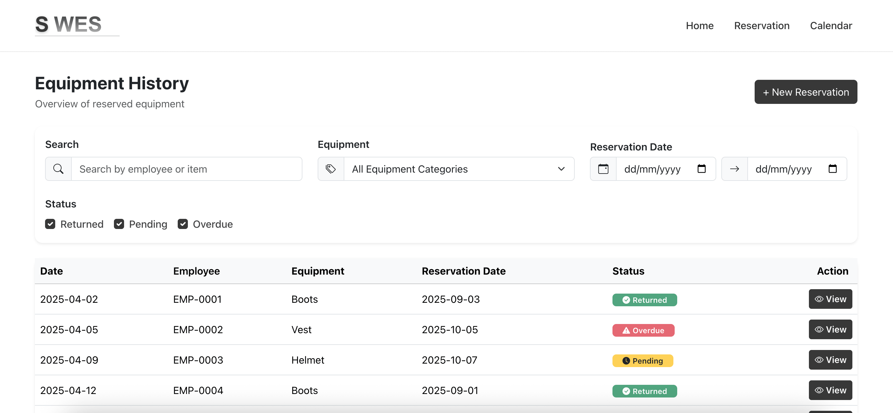

# SWES – Reservation Module

This project is a small **Single Page Application (SPA)** built as part of a front-end assessment for the SWES system.  
It demonstrates how a reservation workflow can be implemented using **vanilla JavaScript**, a simple router, and mocked backend APIs.

The focus of the project is **clarity, usability, and clean structure** without over-engineering.

## Tech Stack

- **Vite** - bundler & dev server
- **Vanilla JavaScript (ES6+)**
- **Bootstrap 5** – UI & layout
- **FullCalendar** – calendar view
- **Mocked REST APIs** (no backend)

No frameworks were used intentionally to keep the solution lightweight and easy to reason about.

## Screenshots

### Lab Score

### Home Dashboard

## Project Scripts

- `npm run dev`  
  Starts the development server.
- `npm run build`  
  Builds the project for production.
- `npm run preview`  
  Previews the production build locally.